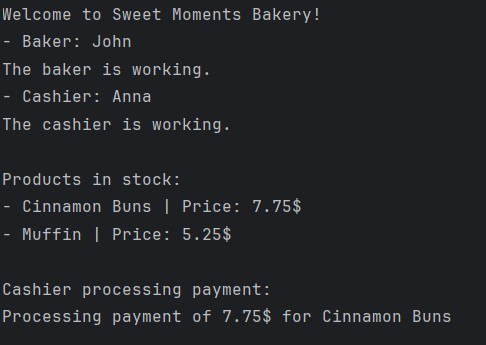

# Topic: SOLID Principles

### Course: Software Design Techniques and Mechanisms
### Author: Daniela Cojocari

----

## Objectives
In this laboratory, I implemented 3 SOLID Principles — Single Responsibility Principle, Open/Closed Principle, and Liskov Substitution Principle, through the development of a Bakery Management System in Java. The 
system models a bakery with employees (bakers and cashiers) and products (cinnamon buns, muffins, etc.), and
demonstrates clean, modular, and maintainable design.

## 1. Single Responsibility Principle
This principle states that "A class should have only one reason to change" which means every class should have a 
single responsibility or single job or single purpose. 

### Implementation in my project:
- Baker and Cashier classes only manage employee-specific behavior (work() method).
- IProduct implementations (CinnamonBuns, Muffin, etc.) handle only product details and recipes.
- BakeryInventory manages product lists; EmployeeManager manages employee lists.

### Code Example
```java
class BakeryInventory {
    private List<IProduct> products = new ArrayList<>();

    public void addProduct(IProduct product) {
        if (product != null) products.add(product);
    }

    public List<IProduct> getProducts() {
        return new ArrayList<>(products);
    }
}
```
> Each class has a single, clear responsibility, making the system easier to maintain and extend.

## 2. Open/Closed Principle
This principle states that "Software entities (classes, modules, functions, etc.) should be open for extension, but
closed for modification" which means you should be able to extend a class behavior, without modifying it. 

### Implementation in my project:
- New products can be added by creating classes that implement IProduct.
- New employee types can be added by extending Employee.

### Code Example
```java
class CinnamonBuns implements IProduct, IRecipe {
    @Override
    public String getName() { return "Cinnamon Buns"; }
    @Override
    public double price() { return 7.75; }
    @Override
    public int grams() { return 120; }
    @Override
    public void recipe() {
        System.out.println("Cinnamon Buns recipe: flour, yeast, milk, sugar, butter, cinnamon. Knead, proof, roll, fill, bake.");
    }
}
```

> The system is easily extendable, and existing classes remain unmodified.

## 3. Liskov's Substitution Principle
The principle was introduced by Barbara Liskov in 1987 and according to this principle "Derived or child classes must
be substitutable for their base or parent classes". This principle ensures that any class that is the child of a parent 
class should be usable in place of its parent without any unexpected behaviour. 

### Implementation in my project:
- Baker and Cashier can be used wherever Employee is expected.
- All IProduct implementations can be used wherever IProduct is expected.
- Methods like EmployeeManager.getEmployees() and loops over IProduct work seamlessly with all subclasses.

### Code Example
```java
for (Employee e : bakery.getEmployeeManager().getEmployees()) {
        System.out.println("- " + e.getRole() + ": " + e.getName());
        e.work();
    }
```
> Subtypes are fully substitutable, ensuring flexible and maintainable design.

## Output Results



The system correctly lists all employees and their roles. Each product displays its name and price, showing modular 
product management. Payment processing is delegated to each product, demonstrating SRP and DIP. The cashier can handle
all products generically, showing LSP. Adding a new product or employee type would not require changing existing
classes, confirming OCP.

## Conclusion
This laboratory successfully demonstrates the implementation of the first three SOLID principles: SRP, OCP, and LSP. 
The design is modular, maintainable, and extendable. Each class has a single responsibility, new functionality can be 
added without modifying existing code, and subclasses can be safely substituted for their parent classes. The project 
also introduces good separation of concerns between employees, products, inventory, and payment processing, which lays 
a solid foundation for implementing the remaining SOLID principles in future extensions.