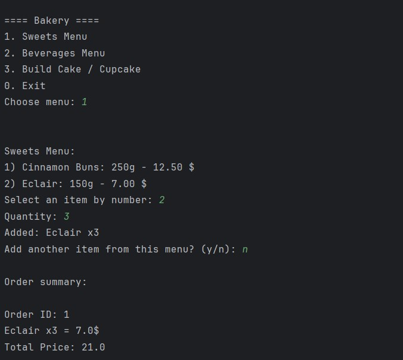
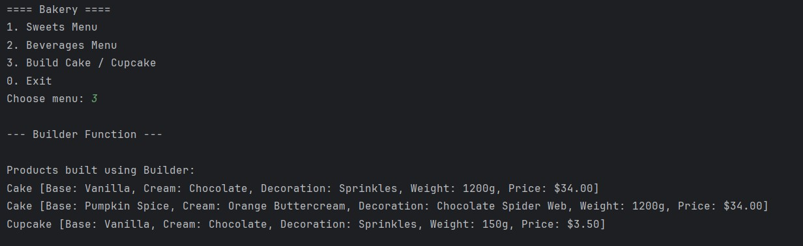

# Topic: Creational Design Patterns

### Course: Software Design Techniques and Mechanisms
### Author: Daniela Cojocari

----

## Objectives
In this laboratory work, I implemented three Creational Design Patterns — Factory Method, Builder, and Singleton — within 
a single project that simulates a bakery system.
The goal was to understand how these patterns simplify object creation, increase code flexibility, and promote loose 
coupling between classes.

## 1. Factory Method
The Factory Method pattern defines an interface for creating an object, but lets subclasses alter the type of objects 
that will be created. This allows the code to depend on abstractions (interfaces) rather than concrete classes.

### Implementation in my project:
- The MenuFactory abstract class defines the factory method createMenu().
- Concrete factories (SweetsMenuFactory and BeveragesMenuFactory) override this method to return their respective menus.
- Each menu (SweetsMenu, BeveragesMenu) implements the IMenu interface and provides a list of available IProduct items such as cakes, cookies, or drinks.
- The main program dynamically chooses which menu to create based on user input, demonstrating polymorphic object creation.

 

## 2. Builder
The Builder pattern separates the construction of a complex object from its representation. This allows the same 
construction process to create different types of objects.

### Implementation in my project:
- The ICakeBuilder interface defines methods for setting cake properties: base, cream, decoration, and weight.
- Concrete builders — CakeBuilder and CupcakeBuilder — implement these steps to create Cake and Cupcake objects.
- The Director class defines different templates (Birthday, Halloween, and Christmas) by combining different property values.
- The builder was demonstrated in the main menu under option “3. Build Cake / Cupcake”, automatically constructing both products with the same steps but different results.

## 3. Singleton
The Singleton pattern ensures that a class has only one instance and provides a global point of access to it.

### Implementation in my project:
- The OrderManager class is implemented as a Singleton. 
- It maintains a single global instance that stores all orders created during program execution. 
- This guarantees that all parts of the program share the same order list.

## Output Results
During execution, the program allows the user to:
1. Select a menu (Sweets or Beverages) and add products to an order.
2. View the order summary managed by the Singleton OrderManager.
3. Demonstrate the Builder pattern by creating ready-made cake and cupcake templates.

## Conclusion
In this laboratory project, I implemented three creational design patterns within a bakery management system. 
The Factory Method was used to create different types of menus (sweets and beverages) dynamically, making the code 
flexible and easy to extend. The Builder pattern was applied to construct complex bakery items like cakes and cupcakes 
through predefined templates, showing how the same construction process can produce different results. The Singleton
pattern ensured that all orders were managed consistently through a single global instance of the OrderManager. 
Overall, these patterns helped organize the code better, made object creation more efficient, and improved the 
maintainability and scalability of the project.