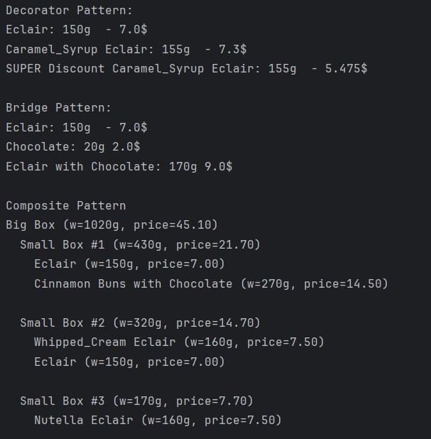

# Topic: Structural Design Patterns

### Course: Software Design Techniques and Mechanisms
### Author: Daniela Cojocari

----

## Objectives
In this laboratory work, I implemented three Structural Design Patterns — Bridge, Composite, Decorator — within
a single project that simulates a bakery system.

The goal was to explore and demonstrate how these patterns can be applied to model real-world scenarios, allowing
flexible combinations of products and fillings, dynamic addition of features such as toppings and discounts, and 
hierarchical organization of packages. The project aims to show how structural patterns improve code modularity, 
reusability, and maintainability while providing a clear and scalable design for managing products, customizations, 
and packaging in a bakery context.

## 1. Bridge
Bridge is a structural design pattern that lets you split a large class or a set of closely related classes into two 
separate hierarchies—abstraction and implementation—which can be developed independently of each other.

In the bakery project, the Bridge Pattern is used to separate the abstraction of a product from the implementation of 
its fillings, allowing them to vary independently. The `IProduct` interface and concrete product classes (like `Eclair` or 
`CinnamonBuns`) form the abstraction hierarchy, while the `IFilling` interface and its implementations (`VanillaFilling`, 
`ChocolateFilling`) form the implementation hierarchy.

```java
public interface IFilling {
    String getName();
    double getPrice();
    int getGrams();
}

public class VanillaFilling implements IFilling{
    @Override
    public String getName() {   return "Vanilla";   }

    @Override
    public double getPrice() {   return 1.5;   }

    @Override
    public int getGrams() {   return 15;   }
}
```

The `ProductFilling` class acts as the bridge, holding a reference to both an `IProduct` and an `IFilling`. It delegates the
calculation of getName(), getPrice(), and getGrams() to the respective product and filling, combining their values
dynamically.

```java
public class ProductFilling implements IProduct {
    private IProduct product;
    private IFilling filling;

    public ProductFilling(IProduct product, IFilling filling) {
        this.product = product;
        this.filling = filling;
    }

    @Override
    public String getName() {
        return product.getName() + " with " + filling.getName();
    }

    @Override
    public double getPrice() {
        return product.getPrice() + filling.getPrice();
    }

    @Override
    public int getGrams() {
        return product.getGrams() + filling.getGrams();
    }
}

```

This structure allows the project to flexibly combine any product with any filling without modifying either hierarchy, 
supporting scalability and maintainability. For example, you can easily create Eclair with Chocolate or Cinnamon Buns 
with Vanilla without creating new classes for each combination.


## 2. Composite
Composite is a structural design pattern that lets you compose objects into tree structures and then work with these 
structures as if they were individual objects.

In my project, the Composite pattern is implemented using the `IPackage` interface, which defines the common operations 
for all package elements, such as retrieving weight, price, name, and generating a label. 
```java
public interface IPackage {
    int getWeight();
    double getPrice();
    String getName();
    String getLabel();
}
```


The `ProductLeaf` class represents individual bakery items as leaf nodes, encapsulating an `IProduct` and providing their 
weight and price. 
```java
public class ProductLeaf implements IPackage {
    private final IProduct product;

    public ProductLeaf(IProduct product) {   this.product = product;   }

    @Override
    public int getWeight() {   return product.getGrams();   }

    @Override
    public double getPrice() {   return product.getPrice();   }

    @Override
    public String getName() {   return product.getName();   }

    @Override
    public String getLabel() {
        return String.format("%s (w=%dg, price=%.2f)", getName(), getWeight(), getPrice());
    }
}

```

The `Box` class represents a simple container with its own weight and cost, while the `CompositeBox` class acts as a 
composite node that can contain multiple `IPackage` elements, including both `ProductLeaf` and other `CompositeBox` instances. 
```java
public class Box implements IPackage{
    private final String name;
    private final int weightGrams;
    private final double price;

    public Box(String name, int weightGrams, double price) {
        this.name = name;
        this.weightGrams = weightGrams;
        this.price = price;
    }

    @Override
    public int getWeight() {   return weightGrams;   }

    @Override
    public double getPrice() {   return price;   }

    @Override
    public String getName() {   return name;   }

    @Override
    public String getLabel() {
        return String.format("%s (w=%dg, price=%.2f)", getName(), getWeight(), getPrice());
    }
}

public class CompositeBox implements IPackage {
    private final String name;
    private final int weightGrams;
    private final double price;
    private final List<IPackage> children = new ArrayList<>();

    public CompositeBox(String name, int weightGrams, double price) {
        this.name = Objects.requireNonNull(name);
        this.weightGrams = weightGrams;
        this.price = price;
    }

    @Override
    public int getWeight() {
        int sum = weightGrams;
        for (IPackage c : children) sum += c.getWeight();
        return sum;
    }

    @Override
    public double getPrice() {
        double sum = price;
        for (IPackage c : children) sum += c.getPrice();
        return sum;
    }

    @Override
    public String getName() {
        return name;
    }

    // Tree label
    @Override
    public String getLabel() {
        StringBuilder sb = new StringBuilder();
        sb.append(name).append(" (w=").append(getWeight())
                .append("g, price=").append(String.format("%.2f", getPrice())).append(")\n");

        for (IPackage c : children) {
            String childLabel = c.getLabel();
            String indented = childLabel.replaceAll("(?m)^", "  "); // indent 2 spaces
            sb.append(indented).append("\n");
        }
        return sb.toString();
    }
}
```

This structure allows uniform treatment of both individual products and nested boxes, supporting recursive operations 
and hierarchical organization of bakery packages.

## 3. Decorator
Decorator is a structural design pattern that lets you attach new behaviors to objects by placing these objects inside 
special wrapper objects that contain the behaviors.

In my project, the Decorator pattern is realized through the `ProductDecorator` class, which serves as the base 
decorator implementing the `IProduct` interface and holding a reference to a concrete product. 
```java
public class ProductDecorator implements IProduct {
    private IProduct product;

    public ProductDecorator(IProduct product) {   this.product = product;   }

    @Override
    public String getName() {   return product.getName();   }

    @Override
    public double getPrice() {   return product.getPrice();   }

    @Override
    public int getGrams() {   return product.getGrams();   }
}
```

This allows additional behaviors to be added dynamically without modifying the original product. The `ToppingDecorator` extends 
`ProductDecorator` to add various toppings, adjusting the product's name, price, and weight according to the chosen 
topping. 
```java
public class ToppingDecorator extends ProductDecorator {
    private EToppings topping;


    public ToppingDecorator(IProduct product, EToppings topping) {
        super(product);
        this.topping = topping;
    }

    @Override
    public String getName() {
        return topping + " " + super.getName();
    }

    @Override
    public double getPrice() {
        double price = 0;

        switch (this.topping) {
            case Whipped_Cream, Chocolate_Chips, Almond_Granola, Nutella:
                price = 0.5;
                break;
            case Caramel_Syrup, Sprinkles, Marshmallow, Peanut_Butter:
                price = 0.3;
                break;
            case Strawberry_Fluff:
                price= 0.7;
                break;
            default:
                throw new IllegalArgumentException("Invalid topping " + this.topping);
        }

        return price + super.getPrice();
    }

    @Override
    public int getGrams() {
        int grams = 0;

        switch (this.topping) {
            case Whipped_Cream, Chocolate_Chips, Almond_Granola, Nutella:
                grams = 10;
                break;
            case Caramel_Syrup, Sprinkles, Marshmallow, Peanut_Butter:
                grams = 5;
                break;
            case Strawberry_Fluff:
                grams= 15;
                break;
            default:
                throw new IllegalArgumentException("Invalid topping " + this.topping);
        }
        return grams + super.getGrams();
    }
}
```

Similarly, the `DiscountDecorator` applies a discount to the product, modifying its name and price based on 
the selected discount type. Together, these decorators enable flexible and layered enhancements of products while
keeping the core `IProduct` implementations untouched.


## Output Results
The project demonstrates the application of three key structural design patterns in a bakery management context. The 
Decorator Pattern allows dynamic addition of toppings or discounts to products without modifying their original classes. 
The Bridge Pattern separates products from their fillings, enabling independent variation and flexible combination. 
The Composite Pattern models hierarchical packaging, where individual products and boxes of products are treated 
uniformly, supporting recursive calculation of total weight and price. Overall, the implementation shows how these 
patterns enhance flexibility, maintainability, and scalability in managing products, customizations, and packaging.




## Conclusion
In this laboratory work, the implementation of Bridge, Composite, and Decorator patterns demonstrated how structural 
design patterns can improve the organization, flexibility, and maintainability of a software system. The Bridge pattern
allowed independent variation of products and fillings, reducing class proliferation. The Composite pattern enabled 
uniform handling of individual products and nested packages, supporting recursive operations and clear hierarchical 
representation. The Decorator pattern provided a way to dynamically extend product features with toppings and discounts 
without modifying existing classes. Together, these patterns showcase the advantages of modular, scalable, and easily 
extensible design in a practical bakery management context.