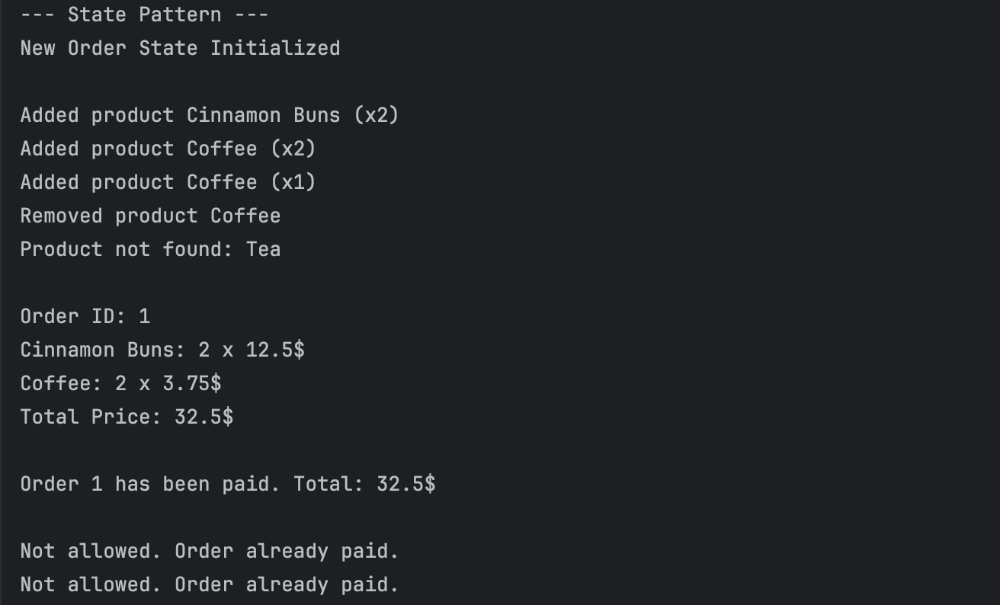
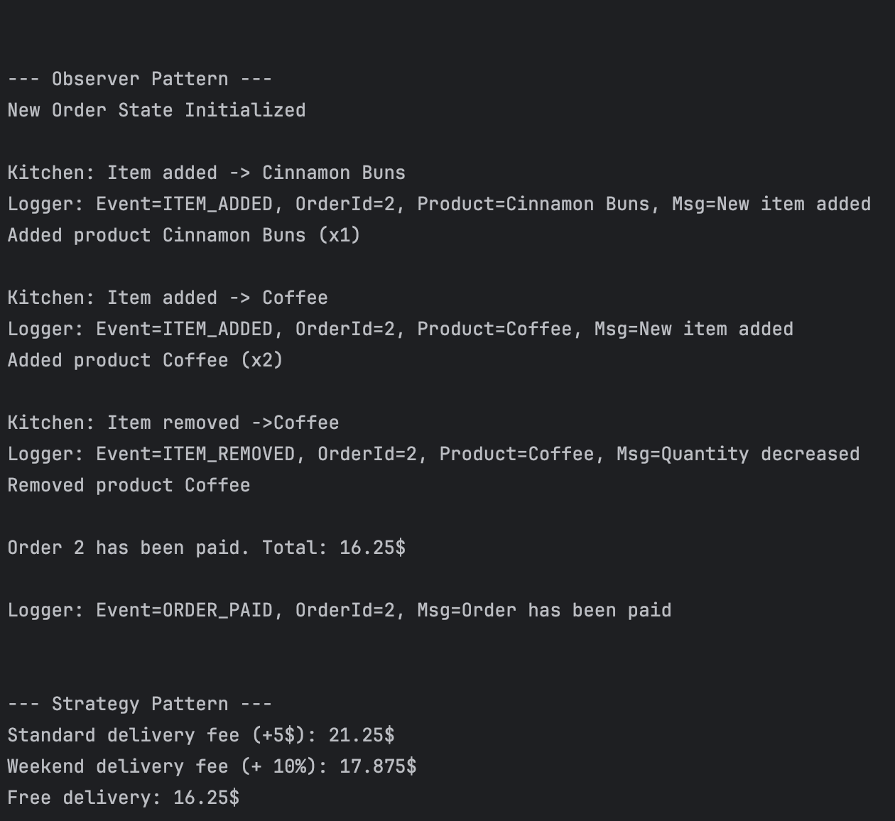

# Topic: Behavioural Design Patterns

### Course: Software Design Techniques and Mechanisms
### Author: Daniela Cojocari

----

## Objectives
In this laboratory work, I implemented three Behavioural Design Patterns — Observer, State, Strategy — within
a single project that simulates a bakery system.

The goal was to understand how behavioural patterns control communication and decision-making inside a system, reduce 
coupling between components, and allow algorithms or behaviours to be selected dynamically at runtime. By applying 
these patterns to a realistic scenario, the laboratory aimed to deepen the practical understanding of how software 
design techniques can improve flexibility, extensibility, and maintainability in application development.

## 1. State

The State pattern was applied to manage the lifecycle of an order. The order can exist only in two minimal states: New 
and Paid. The Order class acts as the context and delegates all state-dependent behavior to its current State object. 

`The NewOrderState` allows the customer to add or remove items and performs the payment operation. 
```java
public class NewOrderState extends State{
    public NewOrderState(Order order) {
        System.out.print("New Order State Initialized");
        super(order);
    }

    @Override
    public void addItem(IProduct product, int quantity) {
        order.addItemInternal(product, quantity);
        System.out.print("Added product " + product.getName() + " (x" + quantity + ")");
    }

    @Override
    public void removeItem(IProduct product) {
        boolean removed = order.removeItemInternal(product);
        if (removed) {
            System.out.println("Removed product " + product.getName());
        } else {
            System.out.println("Product not found: " + product.getName());
        }
    }

    @Override
    public void pay() {
        order.payInternal();
        order.changeState(new PaidState(order));
    }
}
```
Once the payment is made, it triggers a transition to `PaidState`, where all modification operations become restricted. 
Any attempt to change the order after payment results in a simple console message such as “Not allowed. Order already paid.”

```java
public class PaidState extends State {
    public PaidState(Order order) {
        super(order);
    }

    @Override
    public void addItem(IProduct product, int quantity) {
        System.out.println("Not allowed. Order already paid.");
    }

    @Override
    public void removeItem(IProduct product) {
        System.out.println("Not allowed. Order already paid.");
    }

    @Override
    public void pay() {
        System.out.println("Already paid");
    }
}
```
All internal modifications, like adding items, removing items, or completing payment, are done through internal helper 
methods in the `Order` class (e.g., `addItemInternal`, `removeItemInternal`, and `payInternal`). This ensures encapsulation is 
preserved, while the logic that decides whether an operation is permitted resides entirely inside the state classes. The
separation makes it easy to introduce new states in the future, such as Cancelled or Preparing, without altering the 
structure of the Order class itself.

## 2. Observer
The Observer pattern was introduced to allow the system to react automatically to various order-related events without 
tightly coupling these reactions to the order logic. Instead of using UI observers, the system uses console-based 
observers that respond to key events. 

The Order class serves as the subject and maintains a registry mapping event types to their corresponding observers. 
Events such as adding an item, removing an item, paying the order, or changing its state all trigger notifications. 
When an internal action finishes, the order constructs an event object describing what happened and notifies the 
relevant observers. 

```java
public class OrderEvent {
    private final OrderEventType type;
    private final Order order;
    private final IProduct product;
    private final String message;

    public OrderEvent(OrderEventType type, Order order, IProduct product, String message) {
        this.type = type;
        this.order = order;
        this.product = product;
        this.message = message;
    }

    public OrderEventType getType() { return type; }
    public Order getOrder() { return order; }
    public IProduct getProduct() { return product; }
    public String getMessage() { return message; }
}
```

A `KitchenObserver` reacts to events like item addition or order payment, printing messages such as “Item added” 
or “Item removed” 

```java
public class KitchenObserver implements OrderObserver {
    @Override
    public void update(OrderEvent event) {
        if (event.getType() == OrderEventType.ITEM_ADDED) {
            System.out.println("Kitchen: Item added -> " + event.getProduct().getName());
        } else if (event.getType() == OrderEventType.ITEM_REMOVED) {
            System.out.println("Kitchen: Item removed ->" + event.getProduct().getName());
        }
    }
}
```

A `LoggerObserver` subscribes to all events and records them in a consistent format, effectively acting as a lightweight 
audit system. 

```java
public class LoggerObserver implements OrderObserver {
    @Override
    public void update(OrderEvent event) {
        // Logger prints every event type in a concise form
        System.out.println("Logger: Event=" + event.getType() +
                ", OrderId=" + event.getOrder().getOrderId() +
                (event.getProduct() != null ? ", Product=" + event.getProduct().getName() : "") +
                (event.getMessage() != null ? ", Msg=" + event.getMessage() : ""));
    }
}
```

This architecture enables each observer to focus solely on handling its own logic, while the order simply emits events 
without knowing who receives them. As a result, new observers can be added at any time without modifying core order functionality.


## 3. Strategy
The Strategy pattern was implemented to provide multiple interchangeable algorithms for computing the delivery fee. 

Instead of embedding a fixed price-calculation formula inside the system, a `DeliveryStrategy` interface defines the 
structure of any pricing algorithm. 
```java
public interface DeliveryStrategy {
    double execute(double price);
}
```

Several strategy variants were implemented, including a standard delivery fee, a free delivery option, and a weekend 
delivery fee that increases the price proportionally. 
```java
public class StandardDelivery implements DeliveryStrategy {
    @Override
    public double execute(double price) {
        return price + 5.0;
    }
}

public class FreeDelivery implements DeliveryStrategy{
    @Override
    public double execute(double price) {
        return price;
    }
}

public class WeekendDelivery implements DeliveryStrategy {
    @Override
    public double execute(double price) {
        return price * 1.1;
    }
}
```

A `DeliveryContext` class holds the current strategy and applies it whenever the final price needs to be calculated. 
```java
public class DeliveryContext {
    private DeliveryStrategy strategy;

    public DeliveryContext(DeliveryStrategy strategy) {
        this.strategy = strategy;
    }

    public double calculatePrice(double basePrice) {
        if (strategy == null) {
            throw new IllegalStateException("No strategy selected");
        }
        return strategy.execute(basePrice);
    }
}
```

Strategies can be switched at runtime, making it possible to test pricing options easily or adapt the calculation 
depending on conditions such as promotions, holidays, or user preferences. This solution keeps the core order logic 
independent of how the final delivery fee is computed, promoting modularity and allowing new fee algorithms to be 
introduced without changing existing code.

## Output Results
The output demonstrates how each pattern functions within the system. In the State pattern section, the order starts in
the NewOrderState, where items can be freely added or removed, and the console confirms each action; once the order is 
paid, it transitions to the PaidState, and all further modification attempts are rejected, illustrating how behavior 
changes based on internal state. The Observer pattern output shows how subscribed observers react to events: the 
KitchenObserver responds to item additions and removals by printing operational messages, while the LoggerObserver 
records all events, including payment, demonstrating selective and decoupled event notifications. Finally, the Strategy 
pattern output highlights how different pricing strategies affect the final delivery cost: the standard strategy adds 
a fixed fee, the weekend strategy applies a percentage increase, and the free strategy leaves the price unchanged, 
showing how algorithms can be swapped at runtime without altering the order logic.





## Conclusion
In this laboratory work, I successfully explored the core principles of behavioural design patterns by implementing the 
State, Observer, and Strategy patterns in a simplified bakery order system. Each pattern demonstrated a distinct way of 
structuring interactions and behaviors: the State pattern controlled how the order behaved depending on its lifecycle 
stage, the Observer pattern enabled event-driven reactions without coupling the system components, and the Strategy 
pattern allowed multiple price-calculation algorithms to be swapped dynamically. Together, these implementations showed
how behavioural patterns enhance modularity, reduce code duplication, and support future system extensions with minimal 
changes. Overall, the lab strengthened my understanding of designing flexible and maintainable software architectures.